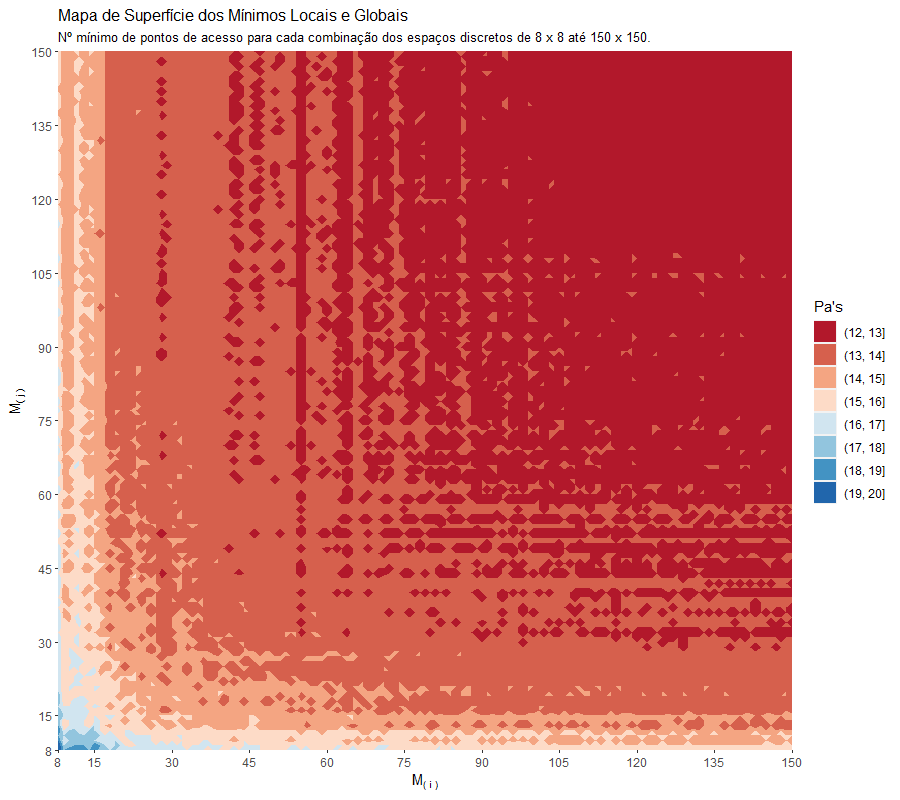

## Abstract

* This article comprises an applied problem of the Decision Theory course from the department of electrical engineering of UFMG taught by Professor Lucas Batista. The objective of this work is to apply the optmization and decision techniques taught throughout the semester. The proposed problem aims to minimize the number of access points routers to supply the Mbps consumption demanded by clients in a controlled environment. Also meeting pre-established optimization restrictions .

## Introdução

*  O problema foi modelado no software R com implementação da função objetivo em C++ .
*  Diferentes espaços de busca foram considerados com o intuito de descobrir a partir de qual densidade de espaço de busca discretizado o algoritmo convergiria para a solução de mínimo global ótima .

## Especificações do Problema

* Deseja-se instalar uma rede WLAN do tipo N 2D para atendimento de um centro de convenções com 800 × 800 metros. Para planejamento dessa rede foram estimados 500 pontos de demanda, com suas respectivas posições geográficas e consumos de largura de banda. O arquivo clientes.csv contém:
  * Coordenada x do cliente em metros.
  * Coordenada y do cliente em metros.
  * Consumo de banda do cliente em Mbps.
  
* Amostra das 10 primeiras observações:
  
```{r warning=F, message=F, error=F, echo=F}

# Carrega Pacotes
library(tidyverse)
library(ggplot2)
library(gridExtra)
library(Rcpp)
library(knitr)

# Importa dados
wlan <- read_csv("https://raw.githubusercontent.com/Protospi/WLAN/main/dados/clientes.csv",
                 col_names = c("x", "y", "Mbps")) %>%
                 mutate(Id = 1:500) %>%
                 relocate(Id, .before = x)

# 5 primeiras observacoes da tabela
kable(head(wlan,10))

```

* Variáveis de Decisão:
  + Coordenadas dos pontos a serem instalados na área de 800 x 800 metros.
  + Ponto de Acesso que será responsável pelo atendimento de cada cliente.
  
* Restrições:
  + Ao menos 95% dos pontos de demanda devem ter suas demandas integralmente atendidas.
  + Cada ponto de acesso a ser instalado tem capacidade de 150Mbps, que não pode ser excedida.
  + Um cliente pode ser atendido por um PA se a distância entre ambos é inferior a 85 metros.
  + Cada cliente só pode ser atendido por um único PA.
  + Devido a restrições orcamentárias, podem ser instalados no máximo 100 PA's.
  
* Simplificações:
  + Os pontos de demanda e seus consumos de banda são estáticos.
  + O efeito de obstáculos no ambiente são desprezados.
  + Um ponto de acesso não causa interferência em outros.
  
## Modelagem

* Definição de Variáveis:
  +  $Pd_i \hspace{0.2cm} \leftarrow$  Pontos de Demanda $i = \{1, 2, 3, ..., 500\}$, $Pd_i \in$ $R\{x, y\}$, x, y = $\{1, ..., 800\}$
  +  $Pa_j \hspace{0.16cm} \leftarrow$ Pontos de Acesso $j = \{1, 2, ..., 100\}$, $Pa_j \in$ $R\{x, y\}$, x, y = $\{1, ..., 800\}$
  +  $\beta_i \hspace{0.43cm} \leftarrow$  Consumo de banda em Mbps dos Pd's, $\forall \hspace{0.1cm} i \in Pd_i \hspace{0.1cm}$
  +  $d_{i,j} \hspace{0.22cm} \leftarrow$  Distância Euclidiana entre $Pd_i$ e $Pa_j$, $\forall \hspace{0.1cm} i \in Pd_i \hspace{0.1cm}$, $\forall \hspace{0.1cm} j \in Pa_j$
  +  $\alpha_j \hspace{0.38cm} \leftarrow$  Ativação do $Pa_j$, $\alpha_j$ $\in \{0,1\}$ $\forall \hspace{0.1cm} j \in Pa_j$
  +  $\eta_{i,j} \hspace{0.24cm} \leftarrow$  Atendimento do $Pd_i$ pelo $Pa_j$, $\eta_{i,j}$ $\in \{0,1\}$ $\forall \hspace{0.1cm} i \in Pd_i \hspace{0.1cm}$, $\forall \hspace{0.1cm} j \in Pa_j$
  
<br>

* Definição da Função 1:
  +  min  $(\sum_{j=1}^{|P_a|} \hspace{0.1cm} \alpha_j)$
  
<br>
  
* Definição da Função 2:
  +  min  $( \sum_{i=1}^{|P_d|} \hspace{0.1cm} \sum_{j=1}^{|P_a|} \hspace{0.1cm} d_{i,j} \hspace{0.1cm} \times \hspace{0.1cm} \eta_{i,j})$
  
<br>
  
* Definição das Restrições:
  +  $\sum_{i=1}^{|P_d|}\hspace{0.1cm} \sum_{j=1}^{|P_a|} \hspace{0.1cm} \eta_{i,j} \hspace{0.1cm} \geq \hspace{0.1cm} 475$
  +  $\sum_{i=1}^{|P_d|} \hspace{0.1cm} \eta_{i,j} \hspace{0.1cm}  \times \hspace{0.1cm} \beta_i \hspace{0.1cm} \le \hspace{0.1cm} 150 \hspace{0.3cm} \forall \hspace{0.1cm} j \in \alpha_j=1$
  +  $\sum_{j=1}^{|Pa|} \hspace{0.1cm} \eta_{i,j} \hspace{0.1cm} \le \hspace{0.1cm} 1 \hspace{0.3cm} \forall \hspace{0.1cm} i \in Pd$
  +  $\sum_{j=1}^{|Pa|} \hspace{0.1cm} \alpha_j \hspace{0.1cm} \le \hspace{0.1cm} 100$
  +  $\exists \hspace{0.1cm} \eta_{i,j} \hspace{0.1cm} \forall \hspace{0.1cm} d_{i,j} \hspace{0.1cm} \le \hspace{0.1cm} 85$
 

## Análise Exploratória


*  Para ilustrar uma visão inicial da distribuição dos clientes no espaço de 800 x 800 foi elaborado um gráfico de dispersão 2d com os dados da localização (x, y) dos pontos de demanda .
*  O parâmetro alpha de transparência foi alterado para 0.5 com o intuito de eliminar o problema da sobreposição de Pd's e facilitar a compreesão da densidade destes pontos .
*  A dimensão de cor foi adicionada considerando o gradiente das cores preta até azul para o consumo de largura de banda requisitada em Mbps por cada cliente.


```{r warning=F, message=F, error=F, echo=F, fig.height=8 , fig.width=9, fig.align="center"}

# Desenha posicao dos pontos de demanda
wlan %>% 
  ggplot(aes(x = x, y = y, color = Mbps))+
    geom_point(alpha = 0.5, size = 3)+
    ggtitle("Gráfico de Dispersão dos Pontos de Demanda",
            subtitle = "Localização dos clientes e seus respectivos consumos em Mbps")

```

*  Existem 2 grandes clusters na dispersão da localização dos clientes em torno dos pontos (200, 200) e (600, 600). Os demais pontos apresentam distribuição esparsa na área de 800 x 800.

*  Na diagonal que vai de (0,0) até (800,800) os pontos de demanda são menos espalhados enquanto que na diagonal (0,800) até (800,0) os pontos estão mais dispersos.

*  Parece não existir padrão visual para a distribuição das demandas de Mbps.


## Espaços de Busca 

*  Se considerada uma escala continua, a área de 800 x 800 metros possuí infinitas coordenadas de possíveis localizações para os pontos de acesso.

*  A construção de espaços de busca considerou espaços discretizados na forma de matrizes do tipo $M_{(i,j)}$ com $i = \{8, 9, ..., 150\}$ e $j = \{8, 9, ..., 150\}$. A posição `i` representa a quantidade de posições igualmente espaçadas no eixo x e da mesma forma, a posição `j` no eixo y.


{width=70%, height=100%}

*  O 1º gráfico no canto superior esquerdo ilustra a discretização da área de 800 x 800 em 8 posições igualmente espaçadas para o eixo x e y totalizando 64 possíveis localizações para os pontos de acesso.

*  Os gráficos fora da diagonal principal ilustram alguns dos espaços discretos irregulares arbitrariamente escolhidos, ou seja, o número de posições diferente para os eixos x e y.

*  O último gráfico no canto inferior direito ilustra a discretização da área de 800 x 800 em 150 posições igualmente espaçadas para o eixo x e y totalizando 22500 possíveis localizações para os pontos de acesso.

* [\textcolor{green}{LINK da Apresentação em Slides: Como Funciona o Algoritmo}](https://rpubs.com/Drope/algoritmo)


## Prototipagem do Algoritmo 

* Testes exploratórios:
  + Discretizações menos granulares que $M_{(8,8)}$ não apresentam solução. 
  + Discretizações mais granulares que $M_{(150,150)}$ apresentam convergência estável. 
  + O custo computacional para executar o algoritmo em `R` foi na unidade de dias.
  
* Os laços para inspecionar o melhor posicionamento dos pontos de acesso em diferentes espaços de busca foram prototipados em `C++`.

* A importação dos dados, a declaração de objetos e a construção dos espaços de busca foram prototipados no ambiente `R`.

### Prototipagem do modulo Rastreador em C++

```{Rcpp eval = F}

// Função para calcular o quadrado de um número
double enquadra(double x){
  double quadrado = x * x;
  return quadrado;
}

// Função para contar o nº de Pd's cobertos pelo raio de um Pa
std::vector<double> conta_pontos(x, y, wlanx, wlany, indice) {
  int n = wlany.size(); double soma; double raio = square(85); indices(0);
  for(int i = 0; i < n; i++) {
    soma = enquadra(wlanx[i] - x) + square(wlany[i] - y);
    if( soma <= raio) {
      indices.push_back(indice[i]);}}
  return indices;
}
  
// Função para inspecionar espaços de busca discretos  
List rastreia(int intervalo_x, int intervalo_y, DoubleVector wlanx,
              DoubleVector wlany, DoubleVector centro_x, DoubleVector centro_y,
              NumericVector indice, int mais_populoso, std::vector<int> viola) {
  std::vector<double> cobertura(0);
  List ret;
  int intervalos = intervalo_x * intervalo_y; 
  for (int j = 2; j <= intervalos; j++) {
    if( (conta_pontos(centro_x[j],centro_y[j],
                      wlanx, wlany, indice).size() >= 
         conta_pontos(centro_x[mais_populoso], centro_y[mais_populoso],
                      wlanx, wlany, indice).size() ) &&
        (! std::count(viola.begin(), viola.end(), mais_populoso) ) ){
      mais_populoso = j;
      cobertura = conta_pontos(centro_x[mais_populoso],
                               centro_y[mais_populoso],wlanx,wlany,indice);}
    ret["cobertura"] = cobertura;
    ret["mais_populoso"] = mais_populoso;}
  return ret;}
}
  
```

* A inspeção das matrizes de busca de espaços discretos quadrados e não quadrados entre $M_{(8,8)}$ e $M_{(150,150)}$, bem como a contagem de pontos de demanda dentro do raio de cobertura de um ponto de acesso foram prototipadas com o modulo rastreador no ambiente C++. Esse modulo contêm as seguintes funções:
  + `enquadra` eleva um número ao quadrado.
  + `conta_pontos` conta o número de pontos dentro do raio de cobertura de um ponto de acesso.
  + `rastreia` inspeciona as melhores coordenadas para cada ponto de acesso dado um espaço discreto.
  

### Prototipagem dos Espaços de Busca em R

*  Para leitura dos dados e laço para combinação de espaços foram utilizadas as facilidades dos ambiente R em operar com data frames e gerar vetores de sequências. 

```{r eval = F}
# Declara objetos e carrega modulo rastreador.cpp 
wlan_completa <- read_csv("clientes.csv", col_names = c("x", "y", "Mbps"))
wlan_id <- wlan_completa %>% mutate(indice = 1:nrow(wlan_completa))
performance <- tibble(intervalos = 8:50, PA = rep(0,143), tempo = rep(0,143))
sourceCpp('rastreador.cpp')

# Laços para combinação de espaços discretos
for(intervalo_x in seq(8, 150, by = 1)){
  for(intervalo_y in seq(8, 150, by = 1)){
    centro_x <- rep(seq(0, 800, length.out = intervalo_x), each = intervalo_y)  
    centro_y <- rep(seq(0, 800, length.out = intervalo_y), times = intervalo_x)
    wlan <- wlan_id; vencedores <- NULL; contador <- 0; Mbps <- NULL; viola <- numeric(1)
    inicio <- Sys.time()
    while(contador < 475){
      cobertura <- NULL; mais_populoso <- 1
      rastreado <- rastrreia(intervalo_x = intervalo_x, intervalo_y = intervalo_y,
                             wlanx = wlan$x, wlany = wlan$y,
                             centro_x = centro_x, centro_y = centro_y,
                             indice = wlan$indice, mais_populoso = mais_populoso,
                             viola = viola) 
      megas <- wlan %>% 
        filter(indice %in% as.integer(rastreado[[1]])) %>%
        summarise(total = sum(consumo)) %>%
        pull(total)
      if(megas < 150){
        Mbps <- c( Mbps, megas)
        vencedores <- c(vencedores, rastreado[[2]])
        wlan <- wlan %>% filter(!indice %in% as.integer(rastreado[[1]]) )
        contador <- contador + length(rastreado[[1]])
        print(paste0("Indice: ", intervalo_x, " - ", intervalo_y, " - ",
                     "Contador: ", contador))} else { viola <- c(viola, rastreado[[2]])}}
    fim <- Sys.time()
    performance$tempo[indice_perfor] <- fim - inicio
    performance$PA[indice_perfor] <- length(vencedores)
    indice_perfor <- indice_perfor + 1}}
}
```

* A função `rastreia` foi utilizada no ambiente `R` por meio do pacote `Rcpp` que carrega o modulo `rastreador.cpp` e constrói a conexão entre os dois ambientes. 


## Convergência

*  O algoritmo completo utlizado para convergência considerou as combinações de espaços de busca de $M_{8,8}$ até $M_{150,150}$ contabilizando o mínimo de 64 o máximo de 22500 coordenadas para possíveis localizações dos pontos de acesso .

*  O mapa de superfície tridimensional foi construído para ilustrar as regiões de inspeção do algoritmo. O gradiente das cores azul(máximo) e vermelho(mínimo) foi utilizado como a terceira dimensão do gráfico para ilustrar o número de pontos de acesso necessários para atingir um mínimo local ou global em cada combinação de discretização do espaço.


{width=100%, height=100%}


*  O ponto na coordenada i = 8 do eixo $M_{(i)}$ e j = 8 do eixo $M_{(j)}$, corresponde a inspeção do espaço de busca $M_{(8,8)}$ que atinge a pior solução ótima de mínimo local gastando 20 Pa's.

*  Entre $M_{(8,8)}$ e $M_{(30,30)}$ o algoritimo passa pelos mínimos locais de 20 até 13, em $M_{(27,43)}$ atinge pela primeira vez o mínimo global de 12 Pa's $M_{(90,75)}$ o algoritimo começa a estabilizar em 12 Pa's com a maioria dos epaços convergindo para 12 Pa's. 

*  O algoritmo estabiliza em 12 Pa´s para espaços discretos mais granularizados que $M_{(110,110)}$ indicando convergência porque até $M_{(150,150)}$ o número de Pa's permanece o mesmo. 


## Custo Computacional

*  As performances de custo computacional do algoritimo nas combinações de espaços de busca foram comparadas utilizando a função `Sys.time()` do `R`. O hardware utilizado foi um processador Intel i7 com 16 GB RAM.

*  O mapa de superfície tridimensional foi construído para ilustrar os tempos computacionais necessários para atingir um mínimo local ou global em cada combinação de discretização do espaço.

{width=100%, height=100%}

*  O ponto na coordenada i = 8 do eixo $M_{(i)}$ e j = 8 do eixo $M_{(j)}$, corresponde a inspeção do espaço de busca $M_{(8,8)}$ que atinge a pior solução ótima de mínimo local com custo computacional de 0.02 segundos.

*  É possível observar 9 intervalos bem distintos com alguns poucos pontos discrepantes dentro de cada curva de nível. Pode-se verificar que a curva vai se tornando mais linear a medida que se aproxima dos maiores tempos. Os custo variaram entre 0.02 e 0.48 segundos.

*  O custo computacional total gasto para inspecionar todos os espaços discretos foi de aproximadamente de 41 minutos.

## Mínimo Global 

*  A solução ótima de mínimo global considerou o espaço de busca $M_{(110,110)}$ totalizando 12100 coordenadas de possíveis localizações para os pontos de acesso. Essa solução foi escolhida porque é um ponto de transição da convergência para estabilização do mínimo global.

*  O algoritmo varreu o espaço de busca de 12100 possíveis localizações para os pontos de acesso e recuperou as localização de 12 coordenadas que minimizam o número de pontos de acesso e satisfazem as condições do problema.


{width=100%, height=100%}

*  O algoritmo gastou 0.35 segundos para atingir o mínimo local de 12 Pa's. É possível observar que ocorre somente uma sobreposição de áreas de cobertura dos pontos de acesso no quadrante superior direito do gráfico .

*  Os 2 Pa's colocados nas coordenadas (192, 199) e (609, 587) estão cobrindo um grande número de Pd's podendo apresentar consumos de banda próximos da saturação. 

## Tabela de Resultados

*  Tabela de localização dos 12 Pa's na área de 800 x 800 com os respectivos consumos totais:}

```{r warning=F, message=F, error=F, echo=F}

# Declara data frame de Pontos otimos e consumo
otimo <- tibble(Pa = 1:12,
                x = c(192, 609, 177, 683, 485, 404, 697, 602, 96, 448, 727, 375),
                y = c(199, 587, 565, 368, 477, 243, 683, 184, 712, 67, 8, 653),
                `Consumo (Mbps)` = c(147.2, 148.1, 6.9, 6.7, 5.7, 5.8, 5.4, 6.6, 4.2, 3.7, 4.6, 2.1))

# Tabela de pontos otimos
kable(otimo)

```

*  É possível observar que os dois clusters principais com um total de 146 Mbps de consumo estão muito próximos da saturação e talvez fosse adequado a colocação de mais 2 Pa's nessas regiões para garantir a integridade da entrega do sinal onde há maior concentração de pontos de demanda .

*  Outra possível solução seria o deslocamento de 2 Pa's com poucos pontos de consumo para as regiões de clusters de forma que a sobreposição parcial de 2 pontos de acesso sobre os clusters principais diminua o consumo dos Pa's no limiar da saturação e também cubra os pontos vizinhos aos clusters garantindo a cobertura dos mesmos 475 pontos de demanda sem aumentar o número de Pa's .


## Referências

*  Para desenvolver este trabalho foram utilizados os slides e videos fornecidos pelo Professor Lucas Batista do departamento de Engenharia Elétrica da UFMG .

*  Devido a questões legais de proteção aos direitos autorais e regras da UFMG, os slides e videos não puderam ser compartilhados .


